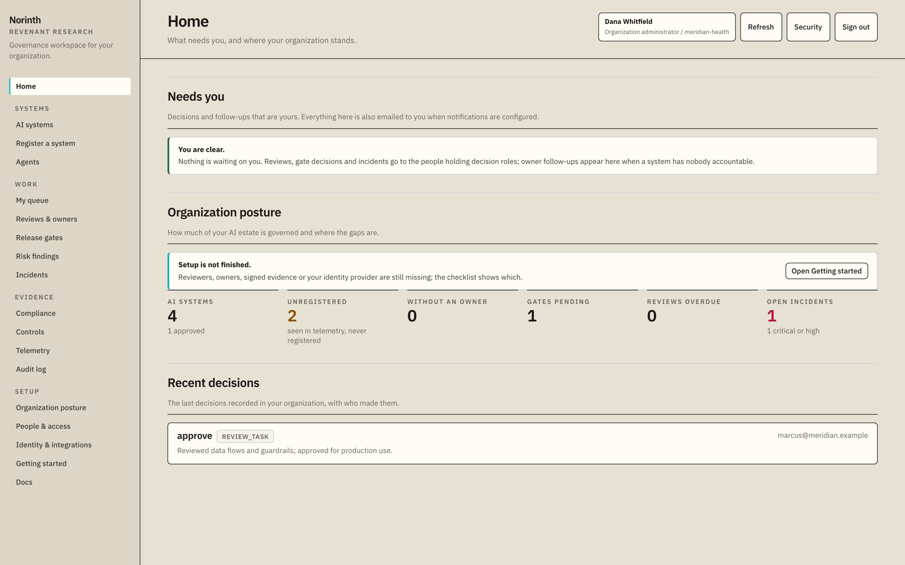
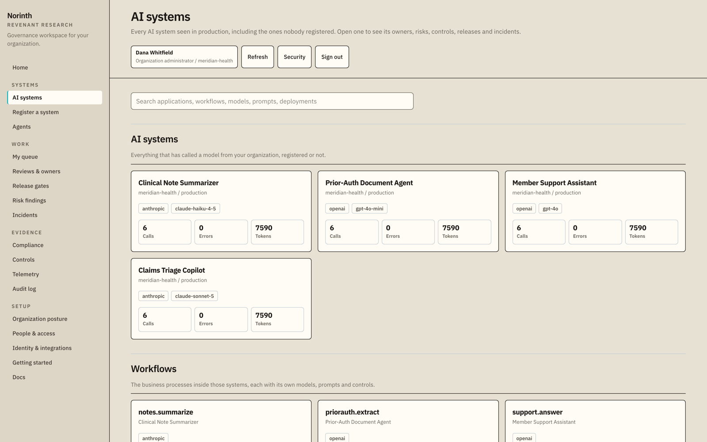
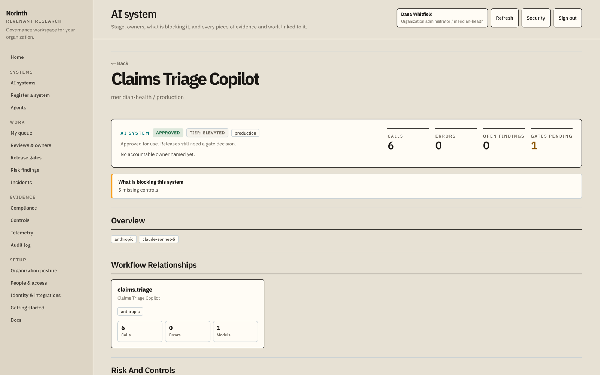
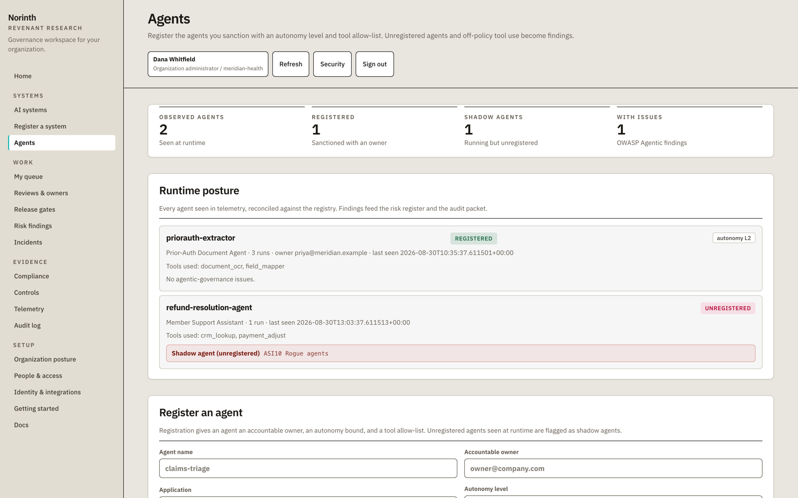
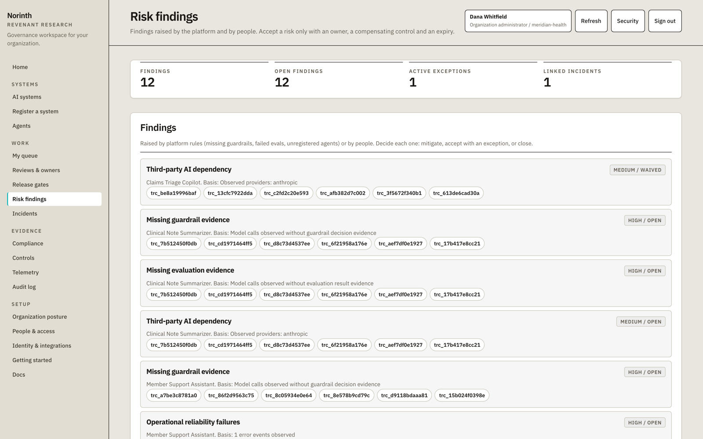
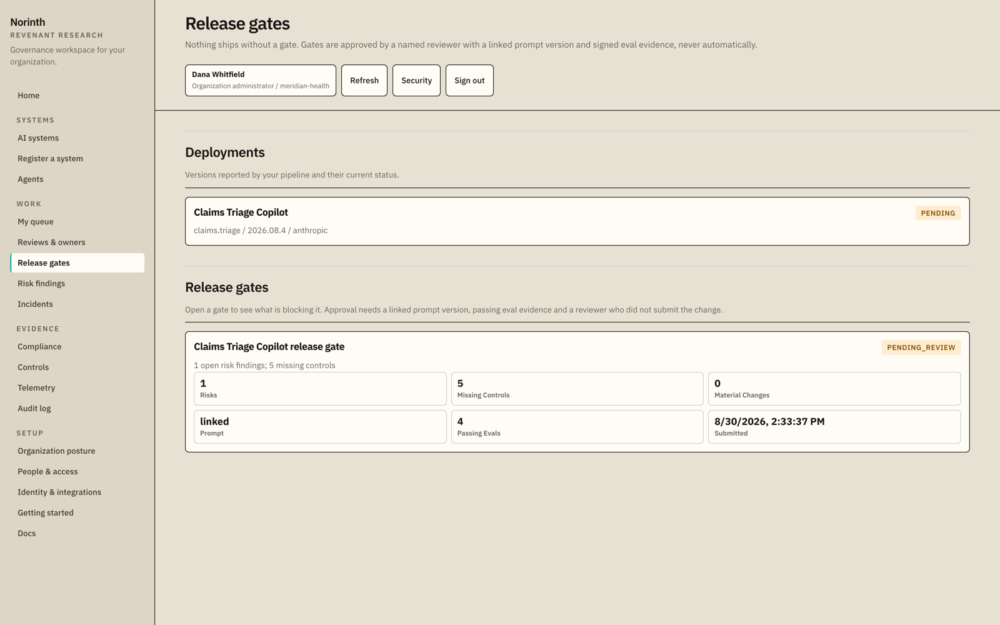
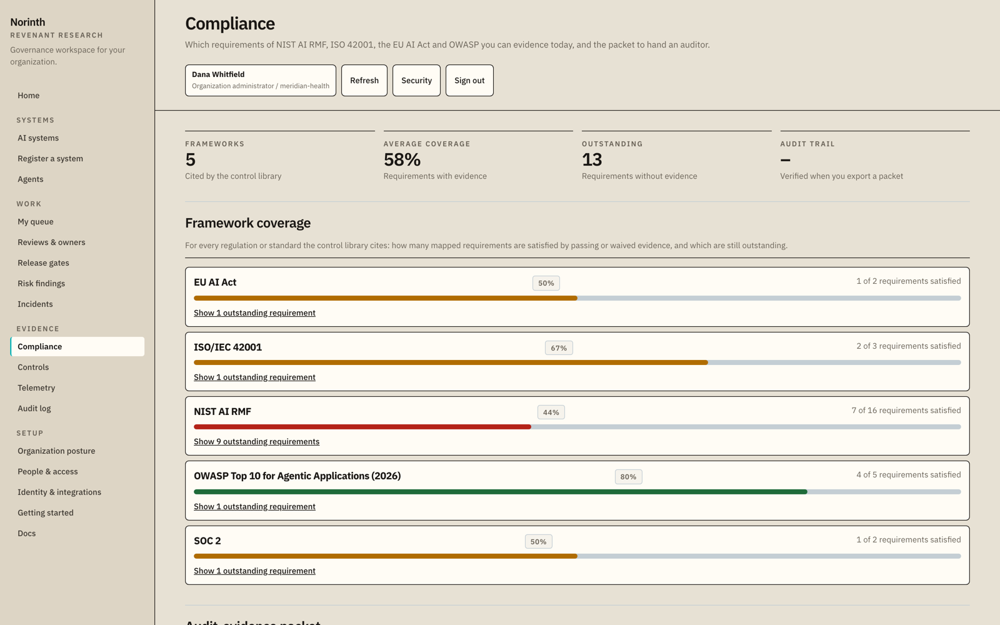
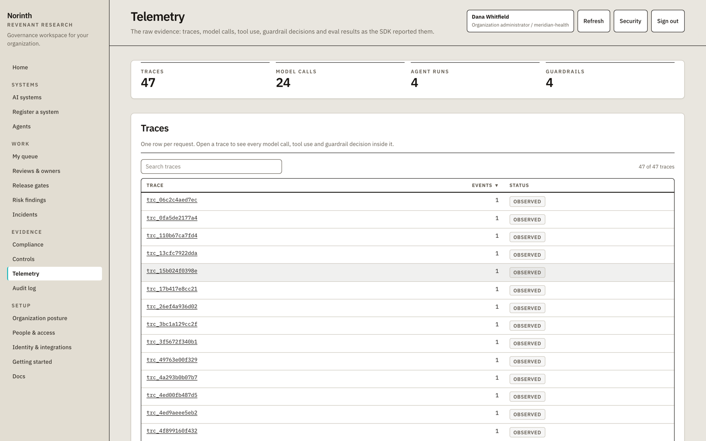
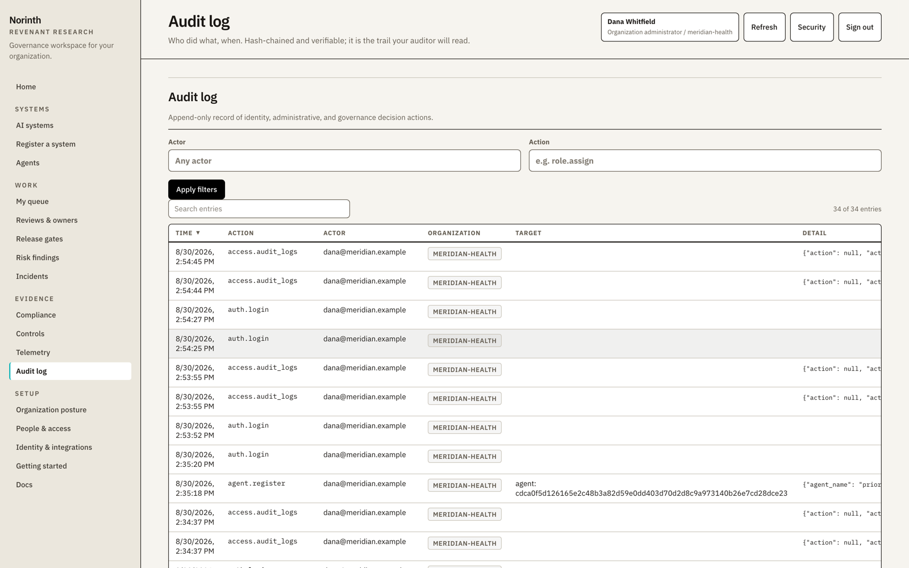
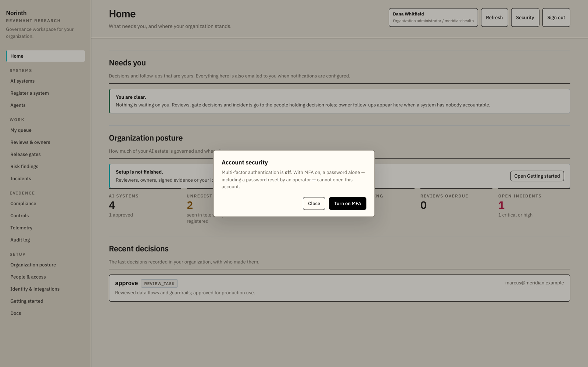

# Norinth

Norinth is an open-source platform for keeping track of the AI systems your
organization runs and showing that they are under control. It reads the
telemetry your applications already produce (model calls, agent runs, tool
calls, retrievals, guardrail checks, evaluation results) and builds four things
from it: an inventory of what is running, evidence for the controls you are
measured against, release gates that block deployments until the evidence
exists, and an audit packet you can hand to an auditor.

[](https://github.com/revenant-research/norinth/actions/workflows/ci.yml)
[](https://github.com/revenant-research/norinth/releases)
[](LICENSE)

You run Norinth on your own infrastructure. There is no hosted version, no paid
tier, and no account with anyone. Everything in this repository is licensed
under [Apache-2.0](LICENSE). Norinth is a product of
[Revenant Research](https://www.revenantresearch.com/).



To run it now, go to [Try it out](#try-it-out). To see what it does first,
keep reading.

## The problem it solves

Once an organization uses AI in production, people ask questions about it.
Which models are we running, and where? Who signed off on this system? What
happens when it gives a bad answer? Auditors, regulators, and internal risk
teams all ask some version of these questions.

The usual answer is a questionnaire that someone fills in by hand. It is out of
date the moment it is saved, and it only covers the systems people remembered
to write down.

Norinth builds the answer from what it observes instead. The record stays
current because it comes from real traffic, and it includes the systems nobody
registered. When a form and the telemetry disagree, the telemetry wins: an open
finding counts as a gap regardless of what the form says.

The screenshots below show a synthetic demo organization ("Meridian Health")
loaded through the public ingestion API, which is the same path your
applications use.

## Features

### Inventory

The inventory is built from telemetry, not from a survey. Systems that appear
in production traffic but were never registered are flagged as unregistered.



Each system has a detail page: its lifecycle stage, its owners, what is
blocking it, and the models, workflows, risks, controls, releases, and
incidents linked to it.



### Agents

You register the agents you allow, each with an owner, an autonomy level, and a
list of permitted tools. Norinth compares every agent it observes against that
list. An unregistered agent, a tool used outside the permitted list, or an
agent that combines untrusted input, sensitive data, and external actions
without a human checkpoint each raise a finding. Findings are mapped to the
OWASP Top 10 for Agentic Applications.



### Risk findings and reviews

Norinth raises findings from what it observes, such as model calls with no
guardrail evidence or an unregistered system in production. People can raise
findings too. Accepting a risk requires an owner, a compensating control, and
an expiry date. When the exception expires, the finding reopens.

The person who submits a change can never be the one who approves it, and
administrator accounts cannot hold decision roles.



### Release gates

A deployment reported by your pipeline gets a gate. The gate stays closed until
the required evidence exists: no open risk findings, no missing controls, no
unreviewed material changes, a linked prompt version, and a passing evaluation
for the exact version being released. Evaluations can be signed by a key your
CI registers, so a passing result cannot be forged by someone who only holds an
ingestion key. The `norinth gate check` command lets CI wait on the gate before
deploying.



### Compliance

Coverage of NIST AI RMF, ISO/IEC 42001, the EU AI Act, SOC 2, and the OWASP
agentic list is computed from control assessments and findings, not
self-reported. The audit packet exports the inventory, an AI bill of materials
(CycloneDX), every decision with its rationale, and the audit trail.



### Telemetry and privacy

You can inspect every event that arrived. What the events contain is limited by
the SDK before it leaves your process. By default, prompts, completions,
metadata values, agent step inputs and outputs, tool arguments, and error
messages are sent as keyed hashes, not text. The hash key comes from your
signing secret, or is derived from your API key if you have not set one, so
the hashes cannot be reversed by guessing. A fixed set of labels that the
platform reads (application name, workflow name, use case, and similar) is sent
in the clear. Capturing raw content is a separate, explicit setting.



### Audit log and authentication

Every decision, export, failed login, lockout, and read of record-level data is
written to an append-only audit log. Each entry is hashed together with the
previous one, so any change to the history is detectable, and there is an
endpoint that verifies the whole chain.

Every account, including the platform administrator, can enroll in TOTP
multi-factor authentication with any authenticator app, and an organization can
require it. Sessions end after a period of inactivity.





## Planned: the governance policy engine

Today the approval workflow is fixed: one reviewer approves or rejects each
submitted system. The next planned capability lets each organization define its
own policy as a versioned document: how many approval stages each risk tier
needs and which roles decide them, how often systems must be recertified, what
evidence each environment's gates require, extra intake form fields, and a
vendor registry checked against the providers seen in telemetry.

The rules that make decisions trustworthy do not become configurable. The
submitter still cannot approve, decisions are still final and audit-logged, and
gates still require evidence. Every decision records the policy version that
governed it, so the packet can show which rules were in force at the time.

The design is in
[`docs/design/governance-policy-engine.md`](docs/design/governance-policy-engine.md).
It is not part of a release yet.

## How it works

There are two pieces, and they meet at one boundary.

1. **The SDK** (or any OpenTelemetry pipeline) runs alongside your AI
   applications and reports what they do. The Python SDK, `norinth-logger`, is
   small and safe to add: it only observes, it never blocks or crashes your
   application if Norinth is down, and by default it sends hashes of prompts
   and responses rather than the text.

2. **The platform** receives that telemetry, builds the inventory and the
   evidence, runs the review and gate workflows, and serves the dashboard and
   the audit packet. It stores everything in a database you control: SQLite
   for trying it out, PostgreSQL for production.

The two never share code. They communicate over a documented, versioned HTTP
protocol (`POST /v1/events/batch` for the SDK, `POST /v1/otel/traces` for
OpenTelemetry), described in
[`packages/python-sdk/PROTOCOL.md`](packages/python-sdk/PROTOCOL.md). That
boundary lets you send data from any language or collector, and it keeps the
SDK small enough to read in one sitting.

## Try it out

This walkthrough takes about fifteen minutes and leaves you with a running
Norinth and some AI systems in the inventory. You need
[Docker](https://docs.docker.com/get-docker/) installed.

### 1. Install and start it

On a laptop or a single VM:

```bash
curl -fsSL https://raw.githubusercontent.com/revenant-research/norinth/main/scripts/install.sh | bash
```

The installer generates every secret for you, starts PostgreSQL and Norinth in
containers, waits until the platform reports healthy, and prints two things:
the URL to open and a temporary administrator login. If you have
[cosign](https://docs.sigstore.dev/) installed, it also verifies the signature
on the container image before running it.

### 2. Finish setup in the browser

Open the URL the installer printed. A new instance shows a setup wizard instead
of the dashboard. It walks you through:

- Signing in with the temporary administrator login and choosing your own
  password.
- Naming your organization.
- Creating an **ingestion key**, the credential your applications will use to
  send telemetry. It is shown once, so copy it somewhere safe.

The wizard then shows an instrumentation snippet filled in with this instance's
address and waits for your first event to arrive.

### 3. Send it some data

The quickest way is to make one AI call through the SDK. In a fresh directory:

```bash
pip install norinth-logger openai
export NORINTH_ENDPOINT="http://localhost:8001"     # the address from step 1
export NORINTH_API_KEY="nrk_...paste_your_key..."   # the ingestion key from step 2
export OPENAI_API_KEY="sk-...your_openai_key..."
```

If the PyPI package is not available yet, the same wheel is attached to every
[GitHub release](https://github.com/revenant-research/norinth/releases).
Install the `.whl` from the latest one.

```python
# try_norinth.py
import os, norinth_logger as norinth
from openai import OpenAI

norinth.init(
    api_key=os.environ["NORINTH_API_KEY"],
    endpoint=os.environ["NORINTH_ENDPOINT"],
    project="getting-started",
    service="hello-norinth",
)

client = norinth.wrap(OpenAI())   # calls made through this client are recorded

reply = client.chat.completions.create(
    model="gpt-4o-mini",
    messages=[{"role": "user", "content": "Say hello to Norinth."}],
)
print(reply.choices[0].message.content)
```

Run it with `python try_norinth.py`. The call goes to OpenAI as usual. On the
way, the wrapped client reports the model, latency, and token usage to your
Norinth instance. Wrapping the client is the whole integration.

If you do not have an OpenAI key, the example still works: the SDK sends its
own health event on startup, so a system appears without the model call.

### 4. Look around

Return to the dashboard and `hello-norinth` appears as a system, with the model
call recorded under it. Click through **AI systems**, **Compliance** (mostly
empty on a fresh install, because coverage reflects real evidence), and
**Telemetry** to confirm what arrived.

That is the whole loop: an application reports what it does, Norinth turns it
into an inventory and evidence, and you govern from there. Real use is the same
loop with more applications and the review, gate, and audit features in play.

## Key ideas

A few terms show up throughout Norinth:

- **Ingestion key.** The credential an application uses to send telemetry to
  your Norinth. You create it inside your own instance (the setup wizard,
  **Identity & Integrations**, or `POST /api/ingestion-keys`). It is prefixed
  `nrk_`, shown once, and tied to your organization, so telemetry sent with it
  can only be written to your own data. It is not an account or a key from any
  external service.

- **Organization (tenant).** Norinth is multi-tenant. Every key, user, and
  record belongs to one organization, and organizations cannot see each other's
  data.

- **Control and framework coverage.** A control is a specific requirement, such
  as "evaluation evidence exists before release". Norinth maps controls to the
  frameworks that name them and reports coverage as the share of mapped
  requirements currently satisfied. It is not a claim about the whole
  regulation.

- **Release gate.** A checkpoint a deployment must pass before it ships.

- **Audit packet.** A single export of everything an auditor would ask for,
  backed by the verifiable audit log.

## Running it for real

The one-command installer is for a laptop or a single VM. For production,
Norinth ships a Helm chart and signed, multi-architecture container images:

```bash
helm install norinth oci://ghcr.io/revenant-research/charts/norinth \
  --set database.url="$DATABASE_URL" \
  --set secrets.secretKey="$(openssl rand -base64 32)" \
  --set secrets.superAdminPassword="$(openssl rand -base64 24)"
```

[`docs/operations.md`](docs/operations.md) covers deployment, the full list of
configuration variables, backups and restores, upgrades, sizing (with a
load-test script and measured numbers), and monitoring: a Prometheus `/metrics`
endpoint, JSON logs with request ids, and an audit stream for your SIEM. The
settings that matter before any non-local deployment (administrator
credentials, signing and encryption keys, secure cookies) are listed in
[`SECURITY.md`](SECURITY.md).

## Running from source

To develop against Norinth or read the code while it runs:

```bash
python -m venv .venv && source .venv/bin/activate
pip install -r requirements-dev.txt
pip install -e packages/python-sdk
make build-frontend                       # builds the dashboard (needs Node 22+)
export NORINTH_PLATFORM_DB=apps/platform/data/norinth.sqlite3
uvicorn app.main:app --app-dir apps/platform --reload --port 8001
```

Running from source with no administrator password set is development mode,
which seeds a well-known `dev` ingestion key so the quickstart works without
minting one. To fill the dashboard with synthetic sample data in that mode:

```bash
export NORINTH_ENDPOINT=http://127.0.0.1:8001 NORINTH_API_KEY=dev
python scripts/seed_dashboard.py
```

Run the same checks CI does with `make lint` and `make test`.

## Repository layout

| Path | What it is |
|---|---|
| `apps/platform/` | The platform: the FastAPI server, the governance engine, and the React dashboard. |
| `packages/python-sdk/` | `norinth-logger`, the Python SDK, and the wire protocol (`PROTOCOL.md`). |
| `deploy/helm/` | The Helm chart for Kubernetes. |
| `scripts/` | The installer, backup and restore, the load-test script, and helpers. |
| `docs/` | Operations and threat-model documentation, design documents, and these screenshots. |

## Documentation

- [`docs/operations.md`](docs/operations.md): deploy, configure, upgrade, back up, size, monitor.
- [`docs/threat-model.md`](docs/threat-model.md): data flow, trust boundaries, and controls.
- [`docs/design/`](docs/design/): design documents (key rotation, the governance policy engine).
- [`SECURITY.md`](SECURITY.md): the security model and how to report a vulnerability.
- [`CONTRIBUTING.md`](CONTRIBUTING.md): how to build, contribute, and cut a release.
- [`packages/python-sdk/README.md`](packages/python-sdk/README.md): the SDK in detail.

## A note on privacy

The SDK only observes. It records structured metadata and keyed hashes of
inputs and outputs, not the raw text, and it never blocks your application. The
hashes cannot be reversed by guessing: they are HMACs keyed by your signing
secret, or by a key derived from your API key when no secret is set. The same
rule covers everything your application passes, not just prompts and
completions: metadata, agent steps, tool arguments and results, usage payloads,
matched guardrail rules, and error messages. With capture off, only a fixed set
of labels (`application_name`, `workflow_name`, `use_case`, `model_purpose`,
`user_id`, `conversation_id`, `tenant_id`, and structural labels such as a
step's tool name) reaches the platform in the clear. Incident descriptions
follow the same rule.

If you turn on content capture (`NORINTH_CAPTURE_CONTENT=true`), the SDK still
masks common secrets and identifiers before anything leaves your process. On
the platform, raw event bodies are encrypted at rest whenever a secret key is
configured. Because you run the whole system, your telemetry never leaves your
network.

See [`packages/python-sdk/README.md`](packages/python-sdk/README.md) for
exactly what crosses the boundary, and how to widen or narrow it.
